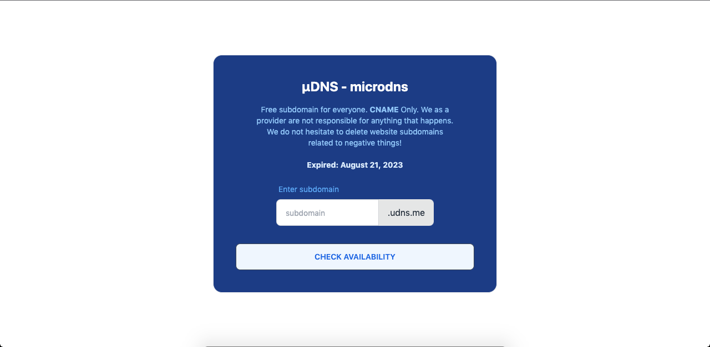

# udns.me

Free subdomain for everyone. **CNAME** Only. We as a provider are not responsible for anything that happens. We do not hesitate to delete website subdomains related to negative things!

This domain is valid until **August 21, 2023** (I don't know what to do with this domain so I made this project).

Have a question or have a problem? Just open the [issue] in this repo!

# Add your free subdomain.

https://udns.me

# Self Hosting

- Fill all the information details in `.env`
- Replace all ".udns.me" or "udns.me" in `views/index.html` and `views/success.html` to your domain (`<script>` section).
- `npm i`
- `node .`
- enjoy.
  > Note: `/add` endpoint has rate limit 250 requests per 15 minutes. You can change the duration in [index.js line 20]()

# To Do

I don't know if this will be done in the near future or in the future. Feel free to contribute 😅️.

- Another records type.
- Edit record.
- Delete record.
